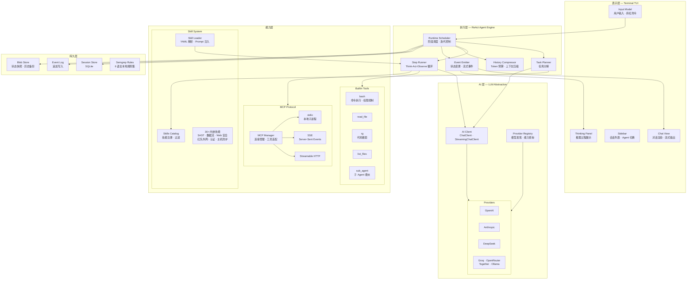

<h1 align="center">ASTER</h1>

<p align="center">
  <strong>A</strong>gent-based <strong>S</strong>ecurity <strong>T</strong>esting & <strong>E</strong>valuation <strong>R</strong>untime
</p>

<p align="center">
  
  
  
</p>

<p align="center">
基于 ReAct 框架的安全分析 Agent，在终端中完成代码审计、渗透测试、主机防护。<br>
内置 Semgrep 规则集 + SyntaxFlow 数据流追踪 + MCP 工具协议 + 多 LLM Provider 支持。
</p>

<!-- TODO: 在这里放一张终端运行截图或 GIF -->
<!-- <p align="center"></p> -->

---

## 目录

- [快速开始](#快速开始)
- [核心特性](#核心特性)
- [安装](#安装)
- [配置](#配置)
- [使用指南](#使用指南)
- [Agent 系统](#agent-系统)
- [技能系统](#技能系统)
- [MCP 集成](#mcp-集成)
- [外部依赖](#外部依赖)
- [项目结构](#项目结构)
- [开发](#开发)
- [路线图](#路线图)
- [致谢](#致谢)
- [License](#license)

---

## 快速开始

```bash
# 1. 构建
git clone <repo-url> && cd sastx
go build -o aster ./cmd/aster

# 2. 配置 API Key（任选一个 Provider）
export OPENAI_API_KEY=sk-your-key

# 3. 启动
./aster
```

启动后进入 TUI 交互界面，输入自然语言即可开始安全分析。默认使用 `code-audit` Agent。

### 场景示例

以下示例展示典型使用场景。每个场景列出所需依赖和最小启动步骤——未安装的可选工具会优雅降级，不影响核心功能。

#### 场景 1: 代码审计（默认 Agent）

默认启动即为 `code-audit` Agent。Semgrep 规则已内嵌于二进制，首次运行自动提取到 `~/.aster/rules/`。

```bash
# 必需：安装 semgrep（SAST 扫描引擎）
pip install semgrep

# 推荐：安装 yak 引擎（数据流追踪，验证漏洞可达性）
# 安装后无需额外配置，默认 config.yaml 已包含 MCP 配置
bash <(curl -sS -L http://oss.yaklang.io/install-latest-yak.sh)
```

```
./aster
> 对当前项目做一次全量安全审计
```

| 工具 | 状态 | 不安装时的影响 |
|------|------|---------------|
| `semgrep` | **必需** | `sast-scan` 技能不可用，退化为纯 AI 代码审查 |
| `yak` 引擎 | 推荐 | `dataflow-analysis` 退化为手动 checklist，漏洞缺少 source-to-sink 可达性验证 |
| `trivy` | 可选 | `dependency-audit` 退化为 AI 分析 manifest 文件，无 CVE 数据库匹配 |

支持语言：Go、Java、Python、JS/TS、PHP、C/C++。详见 → [技能系统](#技能系统)

---

#### 场景 2: 渗透测试

`pentest` Agent 通过浏览器自动化对运行中的 Web 应用进行安全测试。

```bash
# 必需：安装 agent-browser（浏览器自动化），会自动下载 Chromium
npm install -g agent-browser && agent-browser install
```

```
./aster
> /agent pentest
> /mode ai
> 对 http://localhost:8080 做一次全面渗透测试
```

| 工具 | 状态 | 不安装时的影响 |
|------|------|---------------|
| `agent-browser` + Chrome/Chromium | **必需** | 浏览器自动化不可用；SQL 注入、IDOR 等技能仍可基于代码分析工作 |

> **权限模式**：渗透测试产生大量浏览器命令，推荐 `/mode ai` 或 `/mode yolo`（隔离环境）。MANUAL 模式需逐条确认，体验较差。

支持自签证书、SPA/MPA、需认证的站点。详见 → [Agent 系统](#agent-系统)、[外部依赖](#外部依赖)

---

#### 场景 3: 红队外网打点与漏洞验证

`red-team` Agent 面向授权红队外网评估：信息收集、外部攻击面梳理、指纹识别、nuclei POC 匹配和高危漏洞存在性验证。

```bash
# 推荐：安装 nuclei（POC 模板验证）
go install -v github.com/projectdiscovery/nuclei/v3/cmd/nuclei@latest

# 推荐：安装 ProjectDiscovery 侦察工具
go install -v github.com/projectdiscovery/subfinder/v2/cmd/subfinder@latest
go install -v github.com/projectdiscovery/httpx/cmd/httpx@latest
```

```
./aster
> /agent red-team
> /mode ai
> 授权范围：example.com 及 *.example.com；仅验证漏洞是否存在，不获取数据、不拿权限
```

| 工具 | 状态 | 不安装时的影响 |
|------|------|---------------|
| `nuclei` | 推荐 | `nuclei-poc-verification` 退化为模板读取、适用性分析和手工安全验证建议 |
| `subfinder` / `httpx` | 推荐 | 外部资产发现退化为已有输入和轻量 HTTP 分析 |
| `nmap` / `nikto` | 可选 | 端口、服务和 Web 配置扫描需手动或降级完成 |

> **安全边界**：`red-team` 只在授权范围内验证漏洞存在性，默认不获取真实业务数据、不写 WebShell、不拿 shell、不做持久化、不提权、不横向移动。高危 POC 会优先转为最小化、可审计、可复测的安全验证。

本地 nuclei 模板库位于 `pocs/nuclei/`。详见 → [Agent 系统](#agent-系统)、[技能系统](#技能系统)、[外部依赖](#外部依赖)

---

#### 场景 4: 主机防护

`host-defense` Agent 进行安全基线检查、入侵检测和应急响应，**无需额外安装外部工具**。

```
./aster
> /agent host-defense
> /mode ai
> 检查当前主机的安全基线配置
```

| 工具 | 状态 | 不安装时的影响 |
|------|------|---------------|
| `root` / `sudo` 权限 | 推荐 | 部分检查（shadow 文件、SUID 扫描、审计日志）需要权限，无权限时自动跳过 |
| `yara` / `chkrootkit` / `rkhunter` | 可选 | 恶意软件检测退化为 AI 启发式分析 + 内置 bash 检查 |

> **操作系统**：Linux 完整支持，macOS 部分支持，暂不支持 Windows。

详见 → [Agent 系统](#agent-系统)、[技能系统](#技能系统)

---

#### 场景 5: 使用本地模型（Ollama）

无需 API Key，完全离线运行。可搭配任意 Agent 使用。

```bash
# 1. 启动 Ollama
ollama serve

# 2. 拉取模型
ollama pull qwen2.5

# 3. 启动 ASTER
./aster --provider ollama
```

或在 `~/.aster/config.yaml` 中配置：

```yaml
default_provider: ollama

providers:
  ollama:
    base_url: http://localhost:11434/v1
    default_model: qwen2.5:latest
```

> **注意**：本地模型推理能力通常弱于云端大模型，复杂审计场景（多步推理、长上下文）效果可能下降。

详见 → [配置](#配置)

---

#### 场景 6: 自定义 Agent

创建针对特定场景的专属 Agent。在 `~/.aster/agents/api-audit.yaml` 中定义：

```yaml
name: api-audit
role: API 接口安全审计专家
background: |
  专注于 REST/GraphQL API 的认证、授权、输入校验和速率限制审计。
instruction: |
  1. 搜索路由定义和中间件
  2. 加载 sast-scan 进行静态分析
  3. 重点关注：未鉴权端点、SQL 注入、越权访问
skill_names:
  - sast-scan
  - sql-injection-comprehensive
  - auth-comprehensive
  - idor-detection
tool_names:
  - list_files
  - read_file
  - rg
  - list_skills
  - load_skills
```

```
./aster
> /agent api-audit
> 审计当前项目的 API 接口安全
```

详见 → [自定义 Agent](#自定义-agent)、[Agent YAML 字段说明](#agent-yaml-字段说明)

---

#### 场景 7: 接入 MCP 工具

通过 MCP 协议扩展 Agent 的工具集。

**全局配置**（所有 Agent 可用）— 在 `~/.aster/config.yaml` 中：

```yaml
mcp_servers:
  my-tool:
    type: stdio
    command: /path/to/my-mcp-server
    args: ["--mode", "production"]
```

**Agent 专属配置** — 在 Agent YAML 的 `mcp_servers` 字段中定义，仅该 Agent 可见。

```
./aster
> /mcp                        # 查看 MCP 服务器状态
> /mcp connect my-tool        # 运行时连接
> /mcp disconnect my-tool     # 运行时断开
```

支持 stdio / SSE / Streamable HTTP 三种传输方式。详见 → [MCP 集成](#mcp-集成)

---

## 核心特性

| 特性 | 说明 |
|------|------|
| **四大安全 Agent** | 代码审计 / 渗透测试 / 红队外网验证 / 主机防护，YAML 声明式定义，支持自定义 |
| **ReAct 执行引擎** | Plan → Think-Act-Observe → Summary → FinalAnswer 四阶段循环 |
| **Semgrep SAST** | 内嵌本地规则集，覆盖 Go / Java / Python / JS / PHP / C |
| **SyntaxFlow 数据流** | 通过 yak SSA 引擎的 topdef/bottomUse 追踪验证 |
| **MCP 协议** | stdio / SSE / Streamable HTTP 三种传输，全局或按 Agent 挂载 |
| **7 大 LLM Provider** | OpenAI、Anthropic、DeepSeek、Groq、OpenRouter、Together、Ollama |
| **30+ 安全技能** | 按需注入 Agent 上下文，运行时动态启用/禁用 |
| **终端 TUI** | Bubbletea 交互界面，会话管理、主题切换、快捷键操作 |
| **子 Agent 委派** | 支持任务拆解后委派给子 Agent 独立执行 |
| **历史压缩** | Token 超限时自动摘要压缩，支持长对话 |

---

## 安装

### 从源码构建（推荐）

```bash
git clone <repo-url> && cd sastx
make build    # 输出 ./aster 二进制
```

### go install

```bash
go install aster/cmd/aster@latest
```

> 要求 Go 1.25+

---

## 配置

### 配置优先级

```
CLI 参数 > ASTER_* 环境变量 > ~/.aster/config.yaml > Provider 内置默认 > 硬编码兜底
```

### 最小配置

首次运行 `aster` 自动生成 `~/.aster/` 目录。只需提供一个 Provider 的 API Key：

```yaml
# ~/.aster/config.yaml
default_provider: openai

providers:
  openai:
    base_url: https://api.openai.com/v1
    api_key: sk-your-key
    default_model: gpt-4o
```

或通过环境变量：

```bash
export OPENAI_API_KEY=sk-your-key
```

### CLI 参数

```bash
aster --provider deepseek --model deepseek-chat --api-key sk-xxx --base-url https://api.deepseek.com/v1
```

| 参数 | 说明 |
|------|------|
| `--provider` | Provider 名称 |
| `--model` | 模型 ID |
| `--base-url` | API 端点 URL |
| `--api-key` | API 密钥 |

### 环境变量

| 变量 | 说明 |
|------|------|
| `ASTER_PROVIDER` | 覆盖默认 Provider |
| `ASTER_MODEL` | 覆盖默认模型 |
| `ASTER_BASE_URL` | 覆盖 API 端点 |
| `ASTER_API_KEY` | 覆盖 API 密钥 |
| `OPENAI_API_KEY` | OpenAI 专用 |
| `ANTHROPIC_API_KEY` | Anthropic 专用 |
| `DEEPSEEK_API_KEY` | DeepSeek 专用 |
| `GROQ_API_KEY` | Groq 专用 |
| `OPENROUTER_API_KEY` | OpenRouter 专用 |
| `TOGETHER_API_KEY` | Together 专用 |

### 内置 Provider

| Provider | Base URL | 默认模型 |
|----------|----------|----------|
| openai | `https://api.openai.com/v1` | gpt-4o |
| anthropic | `https://api.anthropic.com/v1` | claude-sonnet-4 |
| deepseek | `https://api.deepseek.com/v1` | deepseek-chat |
| groq | `https://api.groq.com/openai/v1` | llama-3.3-70b-versatile |
| openrouter | `https://openrouter.ai/api/v1` | anthropic/claude-sonnet-4 |
| together | `https://api.together.xyz/v1` | meta-llama/Llama-3-70b-chat-hf |
| ollama | `http://localhost:11434/v1` | qwen2.5:latest |

所有 Provider 通过 OpenAI 兼容协议接入。运行时通过 `/provider` 命令在线切换。

### 完整 config.yaml 结构

```yaml
default_provider: openai

providers:
  <name>:
    base_url: <url>              # API 端点
    api_key: <key|${ENV_VAR}>    # 密钥，支持环境变量引用
    default_model: <model_id>    # 该 Provider 的默认模型
    env:                         # Provider 级环境配置（可选）
      HTTPS_PROXY: <proxy_url>
    headers:                     # 额外请求头（可选）
      X-Foo: bar

mcp_servers:
  <name>:
    description: <string>
    type: stdio|sse|streamable-http
    command: <path>              # stdio 模式
    args: [<arg1>, ...]          # stdio 模式
    url: <url>                   # HTTP 模式
    headers:                     # HTTP 模式
      Authorization: "Bearer ${TOKEN}"
    env:                         # 额外环境变量（可选）
      KEY: value
    resident: false              # 是否常驻连接
```

> `providers.<name>.env` 不修改全局环境，仅作为该 Provider 的局部变量源，支持 `${VAR}` 引用和自动代理配置。

---

## 使用指南

### TUI 命令

| 命令 | 说明 |
|------|------|
| `/agent [name]` | 切换 Agent |
| `/provider [name]` | 切换 Provider |
| `/model [name]` | 切换模型 |
| `/skill [enable\|disable] <name>` | 启用/禁用技能 |
| `/mcp [connect\|disconnect] <name>` | 连接/断开 MCP |
| `/mode [yolo\|manual\|ai]` | 切换权限模式 |
| `/session [new\|list\|switch\|delete]` | 会话管理 |
| `/new` | 新建会话 |
| `/clear` | 清空聊天 |
| `/verbose` | 切换工具详情显示 |
| `/theme` | 切换主题 |
| `/help` | 帮助 |
| `/exit` | 退出 |

### 快捷键

| 快捷键 | 说明 |
|--------|------|
| `Tab` | 切换焦点（输入框 / 侧边栏 / 聊天） |
| `Esc` | 返回输入框 |
| `Ctrl+N` | 新建会话 |
| `Ctrl+O` | 会话选择器 |
| `Ctrl+K` | Agent 选择器 |
| `Ctrl+M` | 模型选择器 |
| `Ctrl+L` | 清空聊天 |
| `Ctrl+C` | 取消/退出 |

### 权限模式

控制 Agent 执行 Bash 命令时的授权策略，通过 `/mode` 切换：

| 模式 | 行为 | 适用场景 |
|------|------|----------|
| **YOLO** | 所有命令自动执行 | 可信隔离环境、CTF |
| **MANUAL** | 每条命令需人工确认 | 生产环境、敏感操作（默认） |
| **AI** | 基于风险评估自动决策 | 日常使用推荐 |

AI 模式会先检查 allowlist，未命中则进行风险评估：low risk 自动执行，high/uncertain 请求确认。

---

## Agent 系统

### 内置 Agent

| Agent | 定位 | 核心技能 |
|-------|------|----------|
| **code-audit** | 代码安全审计 | `security-code-analysis`, `sast-scan`, `dataflow-analysis` |
| **pentest** | 渗透测试 | `agent-browser`, SQL 注入/XSS/IDOR 等 |
| **red-team** | 红队外网打点与漏洞验证 | `redteam-methodology`, `external-recon`, `nuclei-poc-verification` |
| **host-defense** | 主机防护 | `baseline-check`, `intrusion-detection`, `malware-detect` |

Agent 定义位于 `~/.aster/agents/`，启动时加载。默认优先加载 `code-audit`。

### 自定义 Agent

创建 `~/.aster/agents/api-audit.yaml`：

```yaml
name: api-audit
role: API 接口安全审计专家
background: |
  专注于 REST/GraphQL API 的认证、授权、输入校验和速率限制审计。
instruction: |
  1. 先了解项目结构
  2. 搜索路由定义和中间件
  3. 加载 sast-scan 进行静态分析
  4. 重点关注：未鉴权端点、SQL 注入、越权访问

skill_names:
  - sast-scan
  - sql-injection-comprehensive
  - auth-comprehensive
  - idor-detection

tool_names:
  - list_files
  - read_file
  - rg
  - bash
  - list_skills
  - load_skills

policies:
  max_iterations: 500
  allow_bash: true
  enable_history_compaction: true
```

保存后重启，通过 `/agent api-audit` 切换使用。

### Agent YAML 字段说明

| 字段 | 说明 |
|------|------|
| `name` | Agent 标识名 |
| `role` | 角色定义 |
| `background` | 能力背景描述 |
| `instruction` | 行为指令 |
| `model_id` | 模型覆盖（可选） |
| `tool_names` | 可用工具列表 |
| `skill_names` | 可加载的技能列表 |
| `preload_skills` | 强制预加载技能（不可禁用） |
| `mcp_servers` | Agent 专属 MCP 服务器 |
| `policies` | 执行策略参数 |

---

## 技能系统

30+ 个内嵌安全分析技能，按 Agent 的 `skill_names` 配置控制可用范围：

| 类别 | 技能 |
|------|------|
| **SAST** | `sast-scan` — Semgrep 多语言扫描（本地规则集） |
| **数据流** | `dataflow-analysis` — SyntaxFlow topdef/bottomUse 追踪 |
| **Web 安全** | `sql-injection-comprehensive`, `file-upload`, `cors-misconfiguration`, `jwt-weakness`, `idor-detection`, `vertical-privilege-escalation`, `unauthorized-access` |
| **认证** | `auth-comprehensive`, `registration-abuse`, `notification-abuse` |
| **隐私** | `sensitive-info-exposure`, `secret-detection` |
| **红队外网** | `redteam-methodology`, `external-recon`, `fingerprint-triage`, `nuclei-poc-verification`, `redteam-report` |
| **主机** | `baseline-check`, `intrusion-detection`, `malware-detect`, `emergency-response`, `log-analysis` |
| **浏览器** | `agent-browser` — Web 安全浏览器自动化 |
| **依赖** | `dependency-audit` — 第三方组件审计 |

### 技能加载机制

```
Agent YAML skill_names → 构建可用列表
                          ↓
运行时: Agent 调用 load_skills → 技能指令注入 prompt
                          ↓
执行模式:
  - inline: 注入当前 Agent 上下文
  - fork:   启动子 Agent 独立执行
```

### 运行时管理

```
/skill                        # 查看所有技能状态
/skill enable sast-scan       # 启用
/skill disable sast-scan      # 禁用
```

> `preload_skills` 中的技能为强制启用，不可通过 `/skill disable` 禁用。

---

## MCP 集成

### 全局 vs Agent 专属

| 类型 | 定义位置 | 可见范围 |
|------|----------|----------|
| 全局 | `config.yaml` 的 `mcp_servers` | 所有 Agent |
| Agent 专属 | Agent YAML 的 `mcp_servers` | 仅该 Agent |

### 传输协议

**stdio — 本地子进程**

```yaml
mcp_servers:
  chrome:
    description: "Chrome 浏览器自动化（Playwright MCP）"
    type: stdio
    command: npx
    args: ["-y", "@playwright/mcp@0.0.75", "--browser", "chrome", "--isolated"]

  syntaxflow:
    type: stdio
    command: /usr/local/bin/yak
    args: ["mcp", "--transport", "stdio", "--tool", "ssa"]
```

**sse — Server-Sent Events**

```yaml
mcp_servers:
  remote-tool:
    type: sse
    url: https://mcp.example.com/sse
    headers:
      Authorization: "Bearer ${MCP_TOKEN}"
```

**streamable-http — 流式 HTTP**

```yaml
mcp_servers:
  cloud-tool:
    type: streamable-http
    url: https://mcp.example.com/api
```

### 运行时管理

```
/mcp                          # 查看状态
/mcp connect syntaxflow       # 连接
/mcp disconnect syntaxflow    # 断开
```

默认配置内置 `chrome` MCP，可通过 `/mcp connect chrome` 接入 Chrome/Playwright 浏览器工具；`agent-browser` 仍作为渗透测试技能中的 CLI 浏览器自动化工具使用。

---

## 外部依赖

ASTER 核心功能开箱即用。以下外部工具可增强特定场景：

### agent-browser（渗透测试）

`pentest` Agent 依赖 [agent-browser](https://github.com/anthropics/agent-browser) 进行浏览器自动化和 Web 安全测试。

```bash
npm install -g agent-browser && agent-browser install
```

> 未安装时：浏览器自动化不可用，但 SQL 注入、IDOR 等检测技能仍可工作。

### Chrome / Playwright MCP（可选）

`/mcp` 面板可连接默认的 `chrome` MCP server，用于通过 MCP 协议暴露浏览器自动化能力。

```bash
npx -y @playwright/mcp@0.0.75 --help
```

> `agent-browser` 是 ASTER 技能直接调用的 CLI；`chrome` MCP 是 `/mcp` 面板里的浏览器 MCP server，两者可以同时存在。

### nuclei / ProjectDiscovery（红队外网验证）

`red-team` Agent 可使用本地 nuclei 模板库进行授权范围内的 POC 筛选和漏洞存在性验证。

```bash
go install -v github.com/projectdiscovery/nuclei/v3/cmd/nuclei@latest
go install -v github.com/projectdiscovery/subfinder/v2/cmd/subfinder@latest
go install -v github.com/projectdiscovery/httpx/cmd/httpx@latest
```

> 未安装时：`red-team` 仍可读取 `pocs/nuclei/` 模板并分析适用条件，但不会自动运行 nuclei 验证。

### yak 引擎（数据流分析）

`dataflow-analysis` 技能通过 MCP 调用 [yak 引擎](https://github.com/yaklang/yaklang) 的 SyntaxFlow SSA 实现数据流追踪。

```bash
bash <(curl -sS -L http://oss.yaklang.io/install-latest-yak.sh)
```

安装后在 `config.yaml` 中配置 MCP：

```yaml
mcp_servers:
  syntaxflow:
    type: stdio
    command: yak
    args: ["mcp", "--transport", "stdio", "--tool", "ssa"]
```

> 未安装时：`sast-scan` 仍可独立工作，但 `dataflow-analysis` 不可用。

---

## 项目结构

```
~/.aster/                        # 用户配置目录
├── config.yaml                  # Provider + MCP 配置
├── agents/                      # Agent YAML 定义
├── data.db                      # 会话存储（SQLite）
└── sessions/                    # 会话数据
```

```
源码结构:
cmd/aster/                       # CLI 入口
internal/
├── react/                       # ReAct Agent 框架（执行引擎、调度器）
├── ai/                          # LLM 抽象层
├── tui/                         # 终端 UI（Bubbletea）
├── mcp/                         # MCP 服务器管理
├── builtin_tools/               # 内置工具（bash, read_file, rg 等）
├── builtin_providers/           # Provider 预设
├── service/                     # 技能服务
└── utils/                       # 通用工具
skills/                          # 内嵌技能定义
├── common/                      # 通用技能
├── code-audit/                  # 代码审计技能
├── pentest/                     # 渗透测试技能
├── red-team/                    # 红队外网打点与 POC 验证技能
└── host-defense/                # 主机防御技能
pocs/nuclei/                     # 本地 nuclei POC 模板库
semgrep-rules/                   # SAST 规则集（6 语言）
```

---

## 开发

### 前置要求

- Go 1.25+
- Make

### 构建与测试

```bash
make build          # 编译 → ./aster
make test           # go test ./... -race -timeout 300s
make vet            # go vet ./...
```

### 架构概览



### 执行策略参数

| 参数 | 说明 | 默认值 |
|------|------|--------|
| `max_iterations` | 最大迭代次数 | 1000 |
| `allow_bash` | 是否启用 bash 工具 | true |
| `enable_history_compaction` | Token 超限时压缩历史 | true |
| `result_source` | 结果提取策略 | latest_step_result |

---

## 路线图

> 以下为计划中的功能方向，按优先级排列。标记 ✅ 表示已有基础设施，需完善集成。

### 近期 — 报告与集成

- [ ] **结果导出** — 支持 SARIF / JSON / HTML 格式输出，便于归档和合规审计
- [ ] **Headless 模式** — 非交互式运行，接受 CLI 参数指定 Agent、目标、输出路径
- [ ] **CI/CD 集成** — 提供 GitHub Actions 示例，扫描结果作为 PR Check 反馈
- [x] **自动更新** — 基于 GitHub Release 的版本检测与二进制替换（✅ 核心已实现，待接入 TUI）

### 中期 — Agent 能力增强

- [ ] **`/agent create`** — TUI 内交互式创建 Agent，免手动编辑 YAML
- [ ] **子 Agent 并行执行** — 同级多个子 Agent 并发运行，加速大型项目扫描
- [ ] **Agent 导入/导出** — 单文件打包分享 Agent 定义 + 关联技能配置
- [x] **Token 用量与费用统计** — 按会话/Agent 维度的用量面板（✅ 计费基础已就绪，待 UI 呈现）

### 远期 — 平台化

- [ ] **工作流 DSL** — 声明式步骤编排，支持条件分支与并行依赖
- [ ] **自定义工具插件** — 通过 MCP 或本地插件协议扩展工具集
- [ ] **REST API** — 提供 HTTP 接口，支持外部系统调度扫描任务
- [ ] **IDE 插件** — VSCode / JetBrains 集成，编辑器内触发安全扫描

---

## 致谢

| 项目 | 用途 | 许可证 |
|------|------|--------|
| [Yaklang](https://github.com/yaklang/yaklang) | SyntaxFlow SSA 数据流分析 | AGPL-3.0 |
| [Semgrep](https://github.com/semgrep/semgrep) | SAST 静态分析引擎 | LGPL-2.1 |
| [Bubbletea](https://github.com/charmbracelet/bubbletea) | 终端 TUI 框架 | MIT |
| [mcp-go](https://github.com/mark3labs/mcp-go) | Go MCP 协议实现 | MIT |

---

## License

本项目源代码基于 [MIT License](LICENSE) 开源。

### 外部工具声明

ASTER 通过子进程 / MCP 协议调用以下外部工具，**不引入、不链接、不修改**其源代码，也不随本项目分发这些工具的二进制文件——用户需自行安装：

| 工具 | 用途 | 工具自身许可证 | 集成方式 |
|------|------|---------------|---------|
| [Semgrep](https://github.com/semgrep/semgrep) | SAST 静态分析引擎 | LGPL-2.1 | CLI 子进程 |
| [Yaklang](https://github.com/yaklang/yaklang) | SyntaxFlow SSA 数据流分析 | AGPL-3.0 | MCP stdio |

> Semgrep（LGPL-2.1）和 Yaklang（AGPL-3.0）的 copyleft 条款不适用于本项目——它们作为独立程序通过进程间通信被调用，不构成衍生作品或组合作品（参见 [GNU GPL FAQ](https://www.gnu.org/licenses/gpl-faq.html#MereAggregation)）。

### 内置规则

`semgrep-rules/` 目录中的 SAST 规则由 ASTER 团队独立编写，随项目以 MIT 协议发布。
